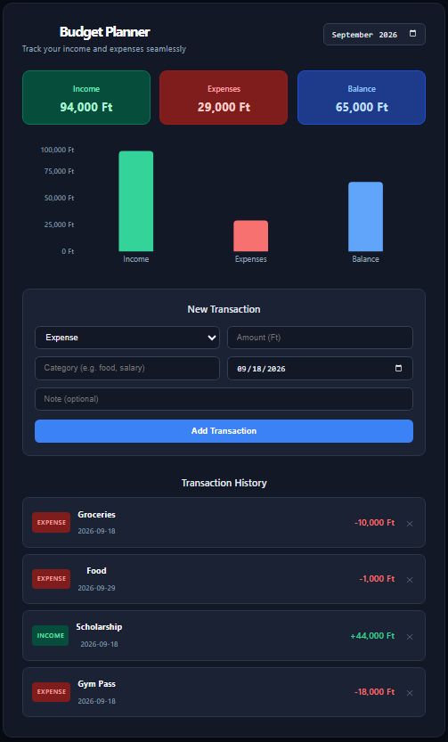

# Budget Planner

A full-stack web app for tracking personal income and expenses.



## Features

- Add and delete income and expense transactions
- Filter transactions by month
- Live summary of total income, expenses, and balance
- Visual bar chart overview
- Dark mode UI

## Tech Stack

**Frontend:** React, Vite, Recharts, Axios  
**Backend:** FastAPI, SQLAlchemy, SQLite  

## Running Locally

### Backend

```bash
cd backend
python -m venv venv
venv\Scripts\activate
python -m pip install fastapi uvicorn sqlalchemy
python -m uvicorn main:app --reload --host 127.0.0.1 --port 8000
```

### Frontend

```bash
cd frontend
npm install
npm run dev
```

Then open `http://localhost:5173`

## Author

Built by Babcsány Péter, first year Computer Science student at Debreceni Egyetem.